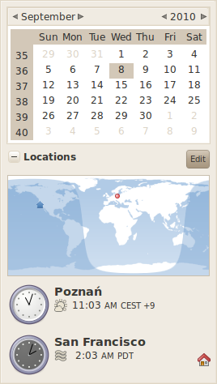
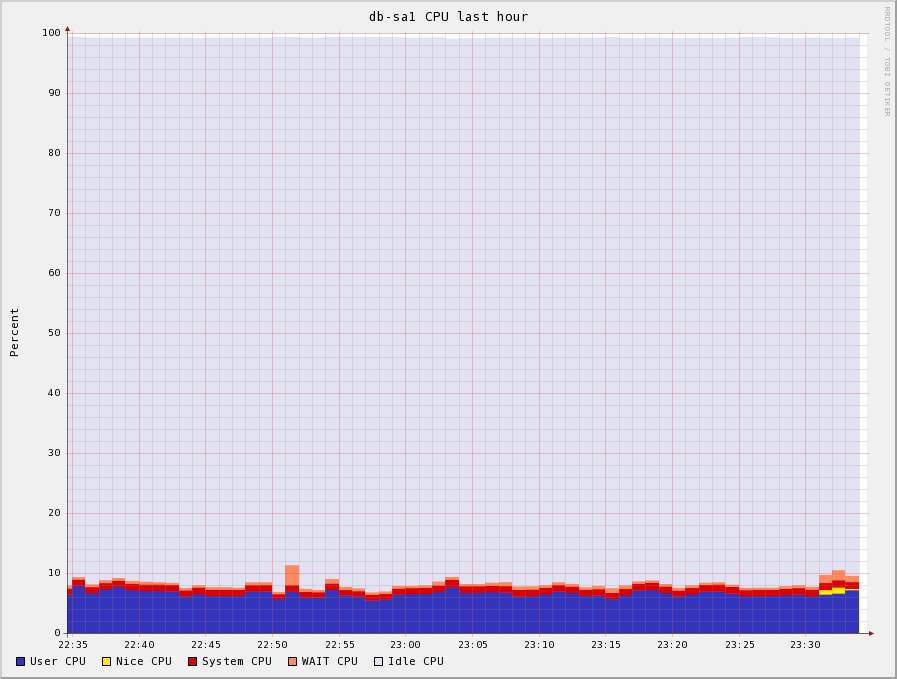

!SLIDE

# The Evolution of Data at Wikia
## From there to here to over there 

!SLIDE bullets

# Jason Cook
* jasonc@simpleideas.org
* github.com/macros
* twitter.com/macros
* freenode #macros
!SLIDE center

# 

!SLIDE 

# 160,000+ Wikis

!SLIDE center

# 

!SLIDE

# 10s of Millions of Articles

!SLIDE center

# 

!SLIDE 

# Passionate Communities

!SLIDE center

# 

!SLIDE

# 246 Languages

!SLIDE center

# 

!SLIDE

# 30+ Million Monthly Visitors

!SLIDE center

# 

!SLIDE 
# The Long Tail
# 

!SLIDE center

# 

!SLIDE center

# 

!SLIDE center

# Free Software 

# 

## http://trac.wikia-code.com

!SLIDE center

# Free Content

# 

!SLIDE bullets

# Wikia Backend Team

* 2 Mgmt/Ops
* 1 Ops/DBA
* 2 Dedicated Ops
* 2 Developers

!SLIDE

# Multiple Time Zones

# 

### Yay for 24hr coverage

!SLIDE bullets
# So where did we start?

* Less than 1000 wikis
* ~200Mbit/s of traffic
* 3 Million daily PVs

!SLIDE bullets

# Wiki Factory

* Maps url to wiki instance
* Per wiki configs

!SLIDE bullets

# Wiki Factory
* Shared user table
* Global and per wiki rights

!SLIDE center

# Databases

!SLIDE bullets
# MySQL Master/Slave Pair

* READ/WRITE splitting
* MASTER_POS_WAIT() consistency
* Slave lag detection

!SLIDE bullets
# 1st Generation DB Hardware

* Dell 2950/6950
* 16GB Ram (Later 32GB)
* Perc5 BBU Raid 10
* 6x15k SAS

!SLIDE bullets
# Then came the read slaves

* Good horizontal scaling
* 90/10 Read/Write ratio

!SLIDE bullets
# Directing queries by type

* Full text search
* Cron
* Extensions (DPL,SMW)

!SLIDE bullets
# Virident

* Flash PCIe card
* Blazing performance
* Very expensive per GB

!SLIDE bullets
# Space started to become an issue

* We store every revision of every page
* Rarely access old revisions
* Fast storage isn't cheap

!SLIDE bullets
# The Archive Cluster

* Much larger slower disks
* Single table for all wikis
* Access by key
* Compressed objects

!SLIDE bullets
# MySQL Full Text Search

* Requires MyISAM
* Slave lag on large wikis
* Strong consistency

!SLIDE bullets
# Migration to Solr

* Happier slaves
* Async updates
* Not as real time

!SLIDE bullets
# Datacenter as SPOF

* Upstream reliability
* Earthquake Zone
* Speed of Recovery

!SLIDE bullets
# Iowa

* Underground bunker
* Full redundant mirror
* Read-only

!SLIDE bullets

# Iowa

* MySQL replication
* Rsync image replication

!SLIDE bullets

# The open table leak

* Resources for open tables never freed
* Fixed in Percona releases
* innodb_dict_size_limit

!SLIDE bullets
# Subdirectory pain

* ext3
* 32,768 subdirectory limit

!SLIDE bullets
# Sharding

* Natural shard on Wiki ID
* Wikis isolated

!SLIDE bullets
# Sharding

* Replicated user table
* Extended Wiki Factory with Cluster ID

!SLIDE center
# Solid State Storage

### (But first a digression)

!SLIDE bullets

# Varnish

* HTML Page cache
* IO Latency sensitive
* Very random IO patterns
* Near worst case for SSD wear

!SLIDE center

# First SSD experiments

!SLIDE bullets

# OCZ MLC Drive

* 0.1MB/s Random write
* Blech

!SLIDE bullets

# SLC Drive

* 1MB/s Random Write
* Ugh, similar to a 15k SAS drive

!SLIDE bullets

# Intel x-25m MLC

* 24MB/s Random Write
* WOW, now we're getting somewhere

!SLIDE bullets

# Not all rosy though

* 25% failure rate on early units
* Write performance degredation
* 2nd Gen drives have been solid

!SLIDE bullets

# Controller issues

* Performance limiter
* No SECURE ERASE functionality

!SLIDE bullets

# OS Issues

* Disk scheduler
* Sector Alignment
* Prefetch

!SLIDE bullets

# First gen varnish hardware

* Dell 1950
* 8 core
* 16GB Ram
* 3x80GB x-25m
* LSI 1068 Controller

!SLIDE bullets
# Retired varnish became first SSD db slave

* No more buffer cache warming
* Much faster than disk slaves
* Almost able to handle full slave load

!SLIDE bullets

# Second gen varnish hardware

* Supermicro 1U
* 8 core
* 48GB Ram
* 4x160GB x-25m on AHCI

!SLIDE bullets

# Current Varnish/DB hardware

* Supermicro 1U
* 12 very fast cores
* 2x15k SAS on BBU Raid
* 6x160GB x-25m on AHCI

!SLIDE bullets

# RAID1 for SAS drives

* OS
* Innodb logs
* Binlogs

!SLIDE bullets

# Software RAID10 for Data

* Rnd Write 240MB/s
* Rnd Read  490MB/s 
* Seq Write 290MB/s
* Seq Read  780MB/s

!SLIDE bullets

# Hardware RAID10 kinda sucked

* Rnd Write 50MB/s
* Rnd Read  57MB/s 
* Seq Write 248MB/s
* Seq Read  823MB/s

!SLIDE center full-page-image

!SLIDE bullets

# Back to Master/Slave Pair

* Fast enough to reduce read slaves
* Some queries 2 order of magnitude faster
* Cache warmup not an issue

!SLIDE bullets

# Wiki Stats Cluster

* Global event table
* Partioned MySQL

!SLIDE bullets

# The paranoia bits

* Weekly snapshots
* binlog shipping to S3
* Delayed slaves
 
!SLIDE bullets

# Where we are now

* 32 Million Daily PVs
* 1Gb/s of compressed HTML
* 3 application shards in 2 datacenters

!SLIDE bullets

# Where we are going

* Riak
* Riakfuse
* Active-Active

!SLIDE bullets

# Riak

* Amazon Dynamo style KV store
* Eventually consistent
* Multi-dc write with Enterprise Edition

!SLIDE bullets

# Riak Session Store

* Write to either DC
* Want to support login while read-only
* Shadow writing for testing

!SLIDE bullets

# Riak Archive Store

* KV Access Pattern
* Immutable objects
* HTTP Access

!SLIDE bullets

# Riak Image Store

* Direct http access
* Object level replication
* Block level dedup
* Riakfuse for legacy access

!SLIDE bullets

# Riakfuse

* Mostly POSIX distributed fs
* Currently in perl
* http://github.com/crucially/riakfuse
* Starting to mirror objects

!SLIDE bullets

# Riak Storage Cluster

* 2U Supermicro
* 2x160GB x-25m RAID1 "Metadata Store"
* 6x2TB SATA RAID5 "Object Store"
* 4 nodes per datacenter

!SLIDE bullets

# Active-Active

* Render READs from both datacenter
* Writes to master DC
* Memcache invalidation race condition

